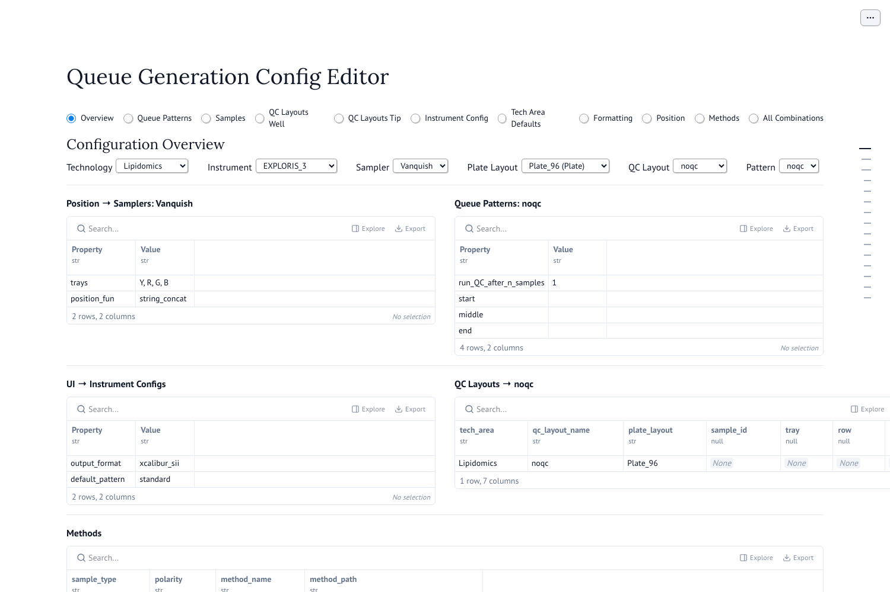
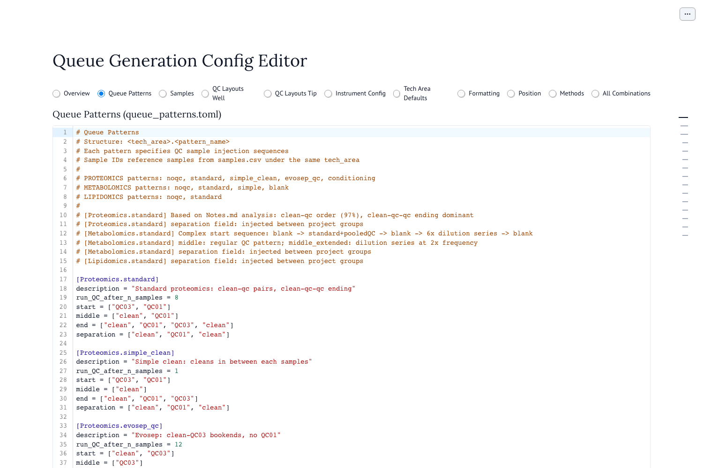
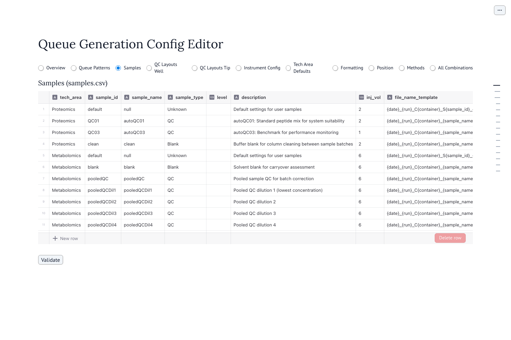
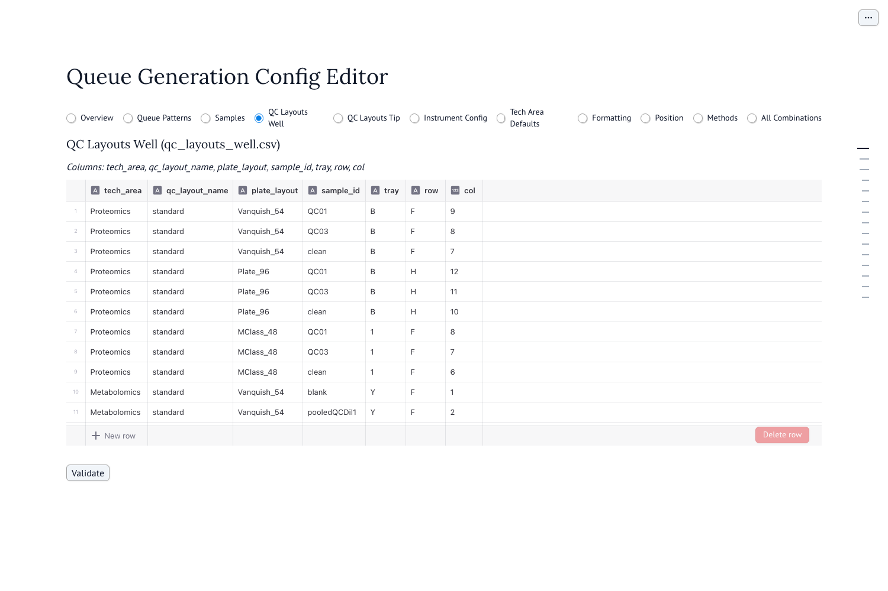

# Queue Generator Configuration Editor Guide

This guide explains how to use the Queue Generator Editor (`make editor`) to modify configurations, such as adding new queue patterns or defining new QC samples.

## Starting the Editor

To start the configuration editor, run the following command in the project root:

```bash
make editor
```

This will launch a web-based interface (Marimo app) in your browser.

For a no-persistence trial run, use:

```bash
make editor-preview
```

Preview mode lets you edit and validate in the browser, then reload the original
configuration. It does not save files or submit a GitLab review.

## Overview of the Interface

The editor is organized into several tabs:

- **Overview**: Select and preview valid combinations of parameters.
- **Queue Patterns**: Edit the logic for QC injection sequences (TOML format).
- **Samples**: Define available sample types (CSV table).
- **QC Layouts Well**: Define where QC/Blank samples are located on well plates (CSV table).
- **QC Layouts Tip**: Define where QC/Blank samples are located on tip plates (CSV table).
- **UI**: Configure which patterns are available for each instrument in the main app.




## Common Tasks

### 1. How to Add a New Queue Pattern

Queue patterns define the sequence of QC shots (Blanks, Standards, Pools) injected at the **start**, **middle**, and **end** of a run.

1.  Navigate to the **Queue Patterns** tab in the editor.
2.  You will see a text editor containing TOML configuration.
3.  Add a new section for your pattern using the format `[<TechArea>.<PatternName>]`.




**Example:** Adding a "HighQC" pattern for Proteomics.

```toml
[Proteomics.high_qc]
description = "High frequency QC for critical samples"
run_QC_after_n_samples = 4         # Inject middle QCs after every 4 user samples
start = ["clean", "QC01", "QC03"]
middle = ["clean", "QC01"]
end = ["clean", "QC01", "QC03"]
separation = ["clean"]             # Optional: injected between project blocks
```

*   **Sample IDs** (e.g., "clean", "QC01"): Must be defined in the **Samples** tab, and the QC samples among them must have positions in the **QC Layouts Well** (or Tip) tab.

### 2. How to Add a New QC Sample

Adding a new QC sample involves three steps: defining the sample, placing it on the plate, and (optionally) using it in a pattern.

#### Step A: Define the Sample
1.  Navigate to the **Samples** tab.
2.  Add a new row to the table.
    *   **tech_area**: e.g., `Metabolomics`
    *   **sample_id**: Unique identifier (e.g., `NewStd_Mix`). **No spaces.**
    *   **sample_name**: Descriptive name (e.g., `New Standard Mix`).
    *   **description**: Description of what it is.
    *   **inj_vol**: Injection volume in µL.
    *   **file_name_template**: Naming convention for the raw file.




#### Step B: Place the Sample on the Plate
1.  Navigate to the **QC Layouts Well** tab (or **QC Layouts Tip** for tip-based samplers).
2.  Add a new row to the table to specify where this sample is located physically.
    *   **tech_area**: `Metabolomics`
    *   **qc_layout_name**: The layout name you are using (usually `standard`).
    *   **plate_layout**: The specific plate type (e.g., `Vanquish_54`, `Plate_96`). Check which plate layouts are available in the **Position** tab.
    *   **sample_id**: The ID you defined in Step A (`NewStd_Mix`).
    *   **tray/row/col**: Position coordinates.
        *   _Note: You may need to add multiple rows if the sample is present in multiple plate types (e.g., one row for `Vanquish_54` and another for `Plate_96`)._




#### Step C: Use the Sample in a Pattern
1.  Navigate to the **Queue Patterns** tab.
2.  Add your new `sample_id` (`NewStd_Mix`) to the `start`, `middle`, or `end` lists of a pattern.

```toml
[Metabolomics.my_new_pattern]
# ...
start = ["blank", "NewStd_Mix", "pooledQC"]
# ...
```

## Validate and Save

1.  Click the **Validate** button at the bottom of the app to ensure your configuration is consistent (e.g., verifying that all sample IDs in patterns exist in the Samples table).
2.  If validation passes, click **Save All** to write changes to disk, or **Submit for Review** if in review mode.
3.  In preview mode, use **Reload Original** to discard browser edits. Preview mode never writes changes to disk.
